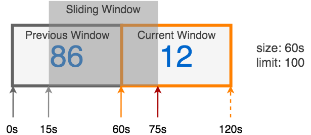

# slidingwindow

Golang implementation of Sliding Window Algorithm for distributed rate limiting.


## Installation

```bash
$ go get -u github.com/RussellLuo/slidingwindow
```


## Design

`slidingwindow` is an implementation of the scalable rate limiting algorithm used by [Kong][1].

Suppose we have a limiter that permits 100 events per minute, and now the time comes at the "75s" point, then the internal windows will be as below:



In this situation, the limiter has permitted 12 events during the current window, which started 15 seconds ago, and 86 events during the entire previous window. Then the count approximation during the sliding window can be calculated like this:

```
count = 86 * ((60-15)/60) + 12
      = 86 * 0.75 + 12
      = 76.5 events
```


## Test Utility


For details, see [testutil](testutil).


## Documentation

For usage and examples see the [Godoc][2].


## License

[MIT][3]


[1]: https://konghq.com/blog/how-to-design-a-scalable-rate-limiting-algorithm/
[2]: https://godoc.org/github.com/RussellLuo/slidingwindow
[3]: http://opensource.org/licenses/MIT