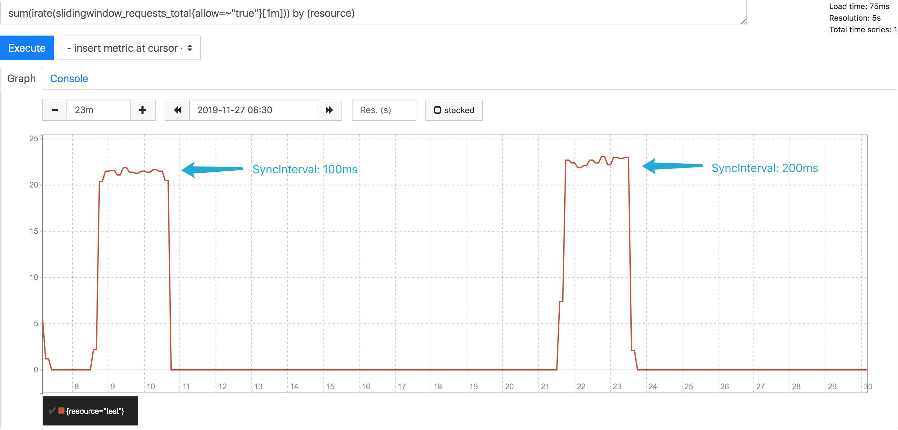

# Test Utility


## Usage

Run the HTTP server (with default options):

```bash
$ go build
$ ./testutil -listen=:8080
```

For the full options, see the help message:

```bash
$ ./testutil -h
Usage of ./testutil:
  -limit int
        The maximum events permitted. (default 20)
  -listen string
        The listen address of the HTTP server.
  -redis string
        The address of the Redis server. (default "localhost:6379")
  -resource string
        The name of the resource that will be limited. (default "test")
  -scale int
        The number of limiters that will work concurrently. (default 2)
  -size string
        The time duration during which limit takes effect. (default "1s")
  -sync string
        The time duration of sync interval. (default "200ms")
```


## Issue requests

Issue requests at the rate of 50/s via [Vegeta][1]:

```bash
$ echo "GET http://localhost:8080/allow" | ./vegeta attack -rate=50/s -duration=2m > /dev/null
```

## See reports

Sync per 100ms:

```bash
$ go build
$ ./testutil -listen=:8080 -sync=100ms
```

Sync per 200ms:

```bash
$ go build
$ ./testutil -listen=:8080 -sync=200ms
```

See reports from [Prometheus][2]:




[1]: https://github.com/tsenart/vegeta
[2]: https://prometheus.io/
